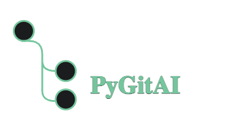

  

Extending `git` with AI!

A python CLI package that contains abstractions over git to make it a bit more smart than it already is, using AI!
 
This app follows traditional Python design philosophy, i.e. to keep it simple and user-friendly.

Introduction 
--------------

The CLI aims to create a plug-and-play ecosystem for all AI models available in the market, even your local trained LLM models, which for instance you can train your model on all your github PRs and files and allow it to generate content as required by your projects. This allows much more flexibility and privacy than expected from LLM APIs and also allows you to harness the power of AI to increase productivity of the developers.

This use of user-chosen models help in generating the boilerplate stuff pretty easily like creating PR content and even generating docstrings and comments for functions(just support Python for now, more support in future). 

Also, the long term goal is to integrate this tool with ghstack, Graphite, and other git based CLI tools. Also I want to increase the ease-of-use of AI in the developer ecosystem space.

Thanks for using this tool. This is my first Python package so please support the project if possible, and forgive me for any poor design choices.

